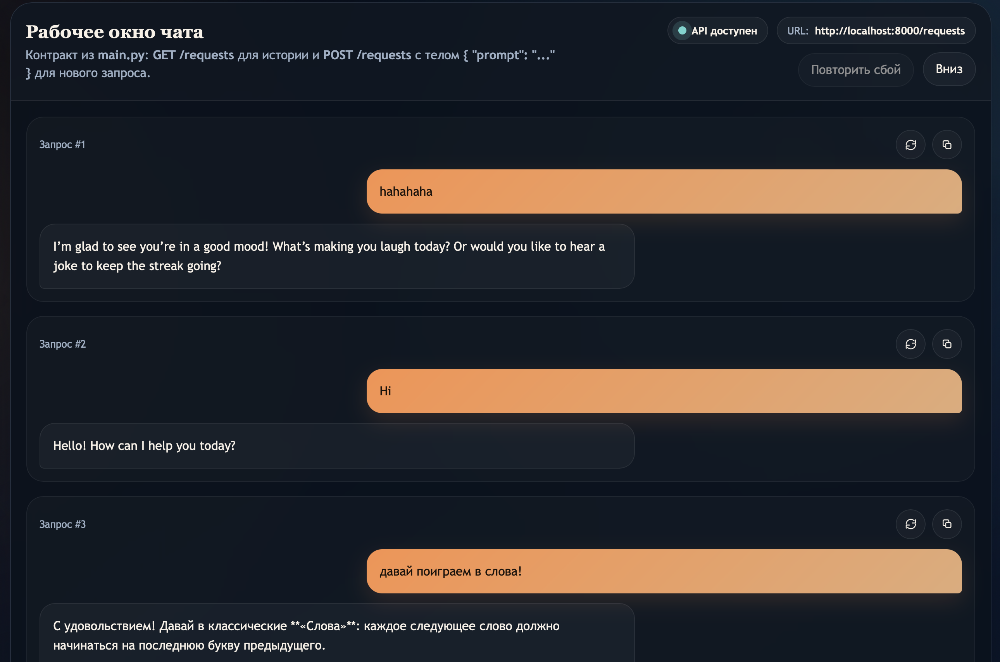
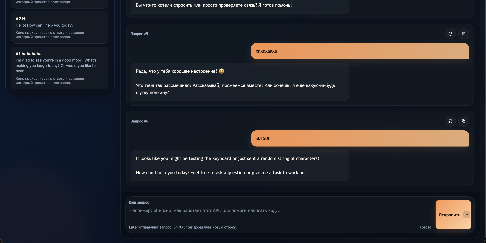
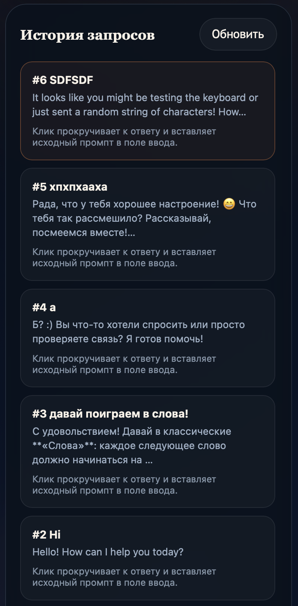

# GPT Talker

Небольшой локальный чат с Gemini: FastAPI backend принимает сообщения, отправляет их в модель, сохраняет историю в SQLite и отдает всё это фронтенду в одном файле `index.html`.

## Что внутри

- чат с историей запросов
- FastAPI backend на `localhost:8000`
- одностраничный фронтенд без сборки
- локальная база `SQLite`

## Скриншоты

### Основной экран



### Вариант интерфейса чата



### Панель истории



## Что нужно для запуска

- Python 3.13+
- Gemini API key

Если вы клонировали этот репозиторий и хотите запустить проект у себя локально, вам нужен **свой Gemini API key**.

## Установка зависимостей

### Вариант 1. Через `uv`

```bash
uv sync
```

### Вариант 2. Через `pip`

```bash
python3.13 -m venv .venv
source .venv/bin/activate
pip install --upgrade pip
pip install -r requirements.txt
```

## Настройка

### 1. Создайте `.env`

```bash
cp .env.example .env
```

### 2. Вставьте свой Gemini API key

Откройте `.env` и укажите ключ:

```env
GEMINI_API_KEY=your_real_key_here
```

## Запуск проекта

### Запуск backend

Через `uv`:

```bash
uv run uvicorn main:app --reload --host 127.0.0.1 --port 8000
```

Через `venv`:

```bash
source .venv/bin/activate
uvicorn main:app --reload --host 127.0.0.1 --port 8000
```

### Запуск frontend

Из корня проекта поднимите простой статический сервер:

```bash
python3 -m http.server 5000
```

После этого откройте:

```text
http://localhost:5000/index.html
```

## Как это работает

- фронтенд отправляет `POST /requests`
- backend вызывает Gemini API
- ответ сохраняется в `request.db`
- история загружается через `GET /requests`

## Частые проблемы

### `GEMINI_API_KEY is not configured`

Проверьте, что:

- в корне проекта есть файл `.env`
- в `.env` указана строка `GEMINI_API_KEY=...`
- backend перезапущен после изменения `.env`

### `OPTIONS /requests 400 Bad Request`

Обычно запущен старый процесс backend. Полностью перезапустите FastAPI.

### `Gemini rejected the API key because it is marked as leaked`

Создайте новый Gemini API key и замените старый в `.env`.
